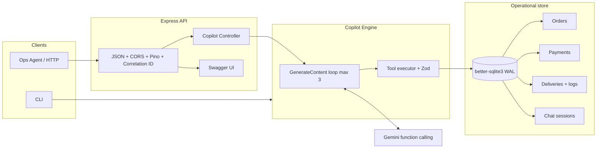

# Operations Copilot — Design

Internal copilot for Cars24 ops agents. The service is a thin Express API in front of SQLite operational data and Gemini native function calling. It is intentionally small: three tools, a bounded orchestration loop, and structured logs with correlation IDs.

## High-level architecture

Request path:

1. Agent posts a question with an optional `sessionId`.
2. Controller validates the body with Zod, opens or resumes a chat session, and persists the user turn.
3. `CopilotEngine` sends conversation history plus the new message to Gemini with three function declarations.
4. If the model returns function calls, they run against `OpsService` in the same turn (parallel per model batch). Results go back as `functionResponse` parts.
5. The loop stops when the model returns text, or after three tool rounds plus a forced wrap-up without tools.
6. The assistant turn and tool trace are stored for audit.

## Trade-off analysis

### TypeScript + native function calling vs LangChain (and similar)

| Concern | This service | Heavy agent frameworks |
| --- | --- | --- |
| Control | Explicit loop, max 3 iterations, typed tool results | Hidden graphs, retry policies, and prompt templates that are hard to audit |
| Types | Zod at the HTTP boundary and at the tool boundary; SQLite rows mapped to interfaces | Runtime dicts and loosely typed tool wrappers |
| Ops cost | One SDK, one model call shape, predictable token spend | Extra abstractions, extra tokens for agent scratchpads |
| Failure modes | Unknown order → `found: false`. Bad args → Zod error returned to the model | Easy to “helpfully” invent an order when retrieval is empty |
| Hiring / review | Any Node engineer can read `copilotEngine.ts` in one sitting | Framework expertise becomes a bottleneck |

LangChain (or Semantic Kernel, LlamaIndex agents) is the right call when you have dozens of tools, RAG over unstructured tickets, and multi-actor workflows. This copilot has three deterministic SQL tools. Native Gemini function calling plus a 40-line loop is the smaller production surface.

SQLite via `better-sqlite3` is the same idea: synchronous, typed statements, WAL, no connection pool theatre for a single-node internal tool. The DAO is isolated so the swap to Postgres later is a file, not a rewrite of the agent.

### Why not “just prompt the model with the whole DB”?

Dumping rows into context does not scale, leaks PII into prompts, and makes hallucination harder to catch. Tools return only the order the agent asked about. The system prompt forbids answering from parametric memory.

## System failure guardrails

| Failure | Behaviour |
| --- | --- |
| Hallucinated order facts | Tools are the only source of truth. Prompt forbids invention. Unknown IDs return `found: false` with an empty payload. |
| Unknown order ID | `OpsService` looks up the primary key. Copilot is instructed to tell the agent the ID is not in the ops DB and to check the `C24-ORD-####` format. |
| Malformed tool args | Zod `orderIdSchema` rejects the payload; executor returns `{ error }` to the model instead of throwing out of the loop. |
| Unknown tool name | Executor returns a structured error; loop continues. |
| SQLite / disk failure | Connection init throws with a log. Health check reports `degraded` if `SELECT 1` fails. |
| Missing API key | Chat returns 503. CLI exits via `assertGeminiConfigured()`. |
| Infinite tool loop / token burn | Hard cap of 3 generate+tool rounds. On the cap, a final call is issued **without** tools and asks the model to answer from data already fetched. `truncated: true` is returned to the client. |
| LLM empty text | Fallback sentence asking the agent to retry with a valid order ID. |
| HTTP validation | 400 with Zod flatten. Unhandled errors: 500 with correlation ID only (no stack to the client). |

Grounding is still probabilistic. Production should add eval cases (known order, unknown order, payment-vs-delivery contradiction) and reject answers that cite IDs that never appeared in tool results.

## Production readiness and scaling roadmap

This assignment binary is a single Node process + a file. That is enough for a desk pilot. The path to production:

1. **Data plane** — Replace SQLite with Aurora PostgreSQL (or RDS). Keep `OpsService` as the only SQL boundary; map the same interfaces. Add read replicas for copilot traffic so agent chat cannot lock write-heavy OMS tables. Move PII (phone numbers) behind field-level encryption or a customer-master lookup.
2. **Cache** — Redis for hot order snapshots (TTL 15–30s) keyed by order ID. Copilot traffic is bursty and repetitive (“status of 1002” ten times a shift). Cache tool results, not model answers, so ops still sees fresh blockers after a payment webhook.
3. **Async logs** — Delivery scan events should land on a queue (SQS / Pub/Sub) and be written by a consumer, not by the copilot process. The copilot stays a read model. Chat audit rows can go to the same queue if SQLite WAL starts to contend.
4. **AuthN/Z** — mTLS or internal IdP (Okta) in front of Express. Scope tools by desk (an agent in Kochi should not need a national dump). Do not expose `/api/v1/docs` on the public edge.
5. **Observability** — Keep pino JSON. Pipe `correlationId` into Gemini request metadata. Add OpenTelemetry around `generateContent` and tool latency. Alert on `truncated=true` rate and tool error rate.
6. **Model routing** — Flash for default desk Q&A; a larger model only when `truncated` or when the question needs multi-order comparison. Pin schemas; treat model upgrades as a deploy.
7. **Horizontal scale** — Stateless API pods. Session store in Postgres/Redis. Gemini client is already per-process. No sticky sessions required if history is loaded from DB.

Until those land, the guardrails above (typed tools, loop cap, `found: false`, correlation IDs) are the production-shaped parts of this codebase.
